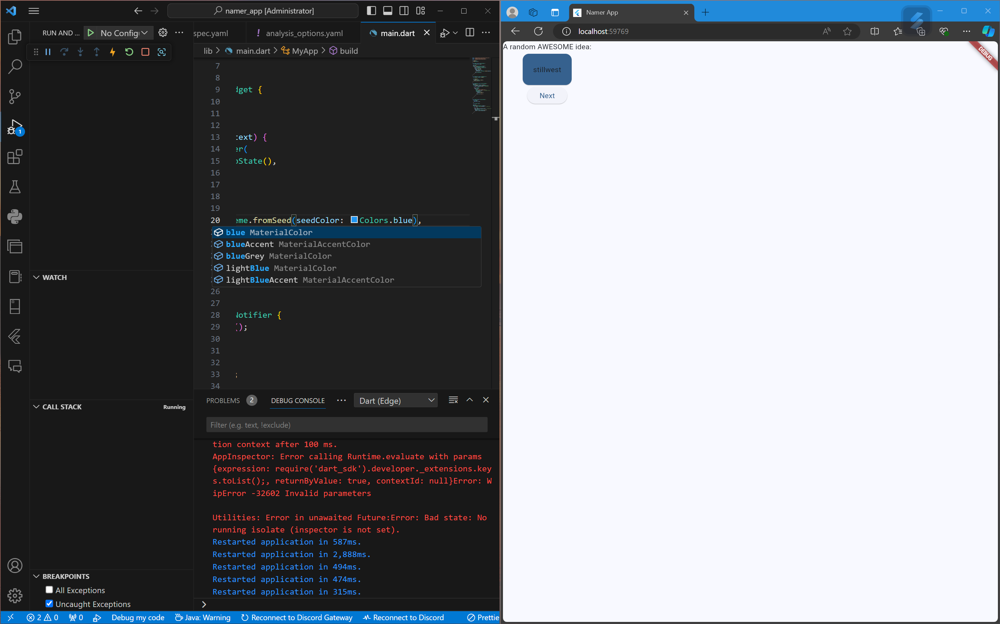
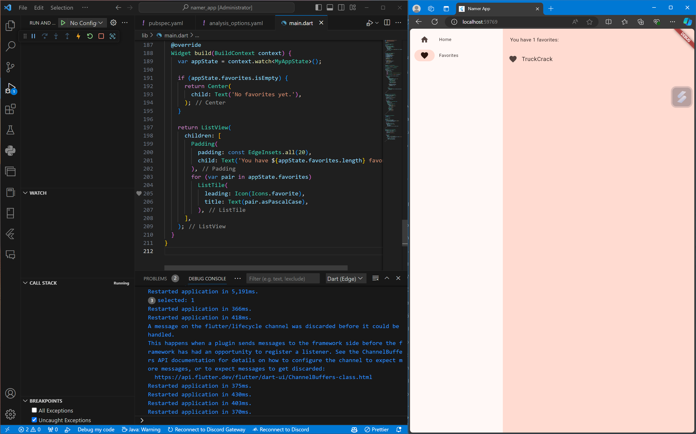

# namer_app

A new Flutter project.

# hello_world

A new Flutter project.

# Nama: Tirta Nurrochman Bintang Prawira
# NIM: 2241720045
# Kelas/Absen: TI-3A/27
# Tugas Praktikum No 4
# Selesaikan Codelabs: Your first Flutter app, lalu buatlah laporan praktikumnya dan push ke repository GitHub Anda!

# 2. Menyiapkan lingkungan Flutter Anda
Editor

Menginstal Flutter

# 3. Membuat project
Membuat proyek Flutter pertama Anda

Menyalin & Menempelkan aplikasi awal

# 4. Menambahkan tombol
Meluncurkan aplikasi

Hot Reload Pertama

# 5. Memperindah tampilan aplikasi
Mengekstrak widget

Menambahkan Kartu

Tema dan gaya

TextTheme

Meningkatkan aksesibilitas

Menempatkan UI di tengah

# 6. Menambahkan fungsi
Menambahkan logika bisnis

Menambahkan tombol

# 7. Menambahkan kolom samping navigasi
Widget stateless versus stateful

setState

Menggunakan selectedIndex

Tingkat respons

# 8. Menambahkan halaman baru
Menambahkan logika bisnis

## Getting Started

This project is a starting point for a Flutter application.

A few resources to get you started if this is your first Flutter project:

- [Lab: Write your first Flutter app](https://docs.flutter.dev/get-started/codelab)
- [Cookbook: Useful Flutter samples](https://docs.flutter.dev/cookbook)

For help getting started with Flutter development, view the
[online documentation](https://docs.flutter.dev/), which offers tutorials,
samples, guidance on mobile development, and a full API reference.
